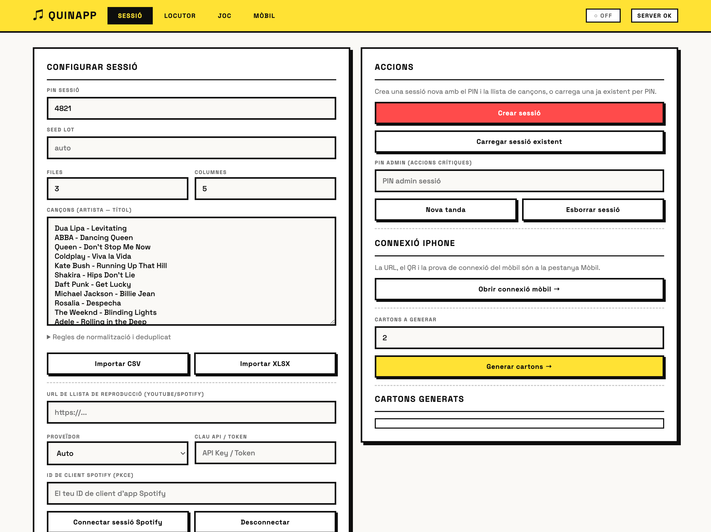
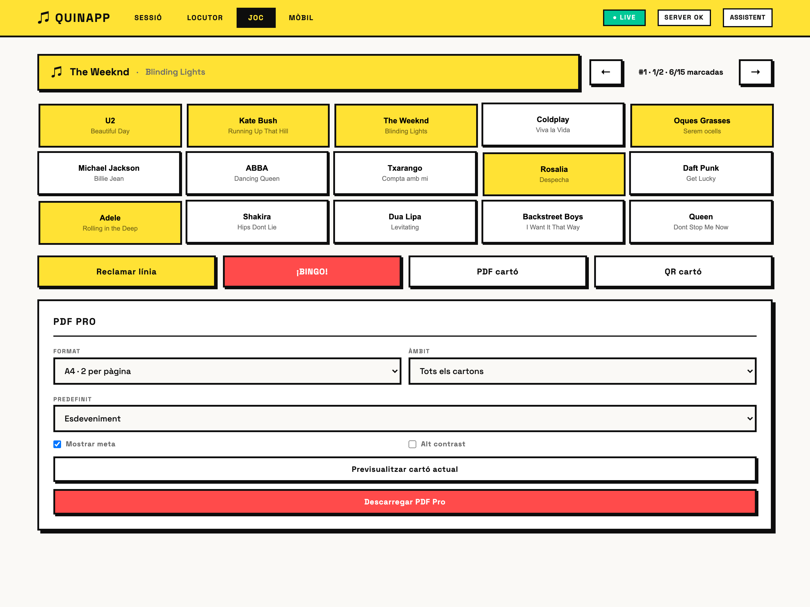
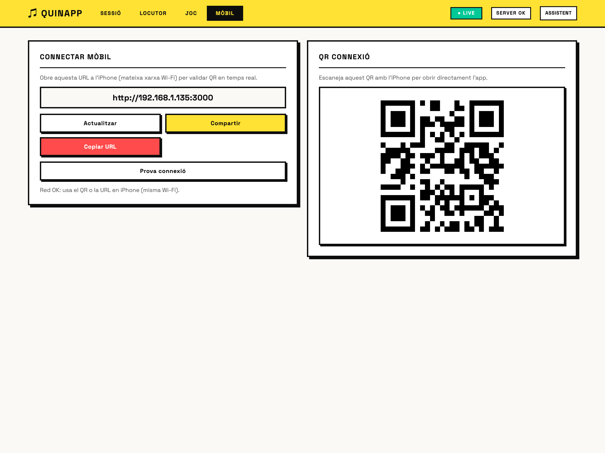

<div align="center">

# 🎵 QUINAPP

**Quina musical (bingo de cançons) per a esdeveniments — app d'escriptori per a macOS.**

Generació de cartons, sorteig de cançons en temps real, reproducció amb Spotify,
exportació de PDF amb QR signats i validació des de l'iPhone.



</div>

---

## Què és

QUINAPP és una eina per organitzar **quines musicals** (bingo on cada casella és una
cançó). El locutor sorteja cançons una a una; els jugadors marquen el seu cartó i
canten *línia* o *bingo*. L'app gestiona tot el flux: muntar la llista, generar cartons,
imprimir-los en PDF amb un QR únic per cartó, sortejar en directe i validar els cartons
guanyadors escanejant el QR amb el mòbil.

Funciona de dues maneres sobre el **mateix servidor** (HTTP + SQLite):

- 🌐 **Mode navegador (multiplataforma)** — `npm start` arrenca el servidor i obre el
  navegador. Funciona a **macOS, Windows i Linux**. És el mode recomanat.
- 🖥️ **App d'escriptori (opcional, macOS)** — embolcall Electron amb empaquetat `.dmg`.

En els dos casos el servidor també serveix la interfície per al mòbil dins la mateixa Wi-Fi.

## Captures

| Locutor (sorteig en directe) | Joc (cartó) |
|---|---|
|  |  |

| Connexió mòbil | Cartó del jugador (mòbil) | Escàner QR per lots |
|---|---|---|
|  |  |  |

## Característiques

- 🎲 **Sorteig determinista i reproduïble** — basat en *seed*; mateixa seed → mateix ordre.
- 📡 **Temps real (SSE)** — locutor, cartons i pantalles de jugador sincronitzats a l'instant.
- 🃏 **Generació de cartons** sense duplicats, mida configurable (files × columnes).
- 📄 **PDF Pro** — A4 (2 per pàgina) o A5, predefinits (esdeveniment / impremta / estalvi tinta),
  cada cartó amb **QR signat (HMAC SHA-256)**.
- 📱 **Validació des de l'iPhone** — escaneja el QR i comprova el cartó contra les cançons sonades.
- 🎧 **Spotify** — login PKCE des de la UI, reproductor embegut i Web Playback SDK.
- 📥 **Importadors** — CSV, XLSX i llistes de YouTube/Spotify.
- 🔗 **Vistes amb deep-link** — cada pestanya té el seu `#hash`; `?load=PIN` obre una sessió directament.
- ♿ **Accessibilitat** — focus visible, `aria-live`, navegació per teclat, `prefers-reduced-motion`.
- 🔒 **Seguretat** — CSP amb *nonce*, secret QR per instal·lació, rate-limit i validació estricta.

## Arquitectura

```
┌────────────────────────────────────────────────────────────┐
│  Electron (finestra escriptori)                            │
│   └─ carrega http://127.0.0.1:3000                         │
│   └─ arrenca servidor embegut + watchdog de health         │
└──────────────────────────┬─────────────────────────────────┘
                           │
        ┌──────────────────▼───────────────────┐
        │  apps/api  (Node http, sense framework)│
        │   ├─ REST + SSE realtime               │
        │   ├─ SQLite (better-sqlite3, WAL)      │
        │   ├─ PDF (pdf-lib) + QR (qrcode)       │
        │   └─ pàgines mòbil (validate / play)   │
        └──────────────────┬───────────────────┘
                           │  serveix
        ┌──────────────────▼───────────────────┐
        │  apps/web  (HTML/CSS/JS vanilla)       │
        │   4 pestanyes: Sessió·Locutor·Joc·Mòbil│
        └────────────────────────────────────────┘

 packages/core → lògica pura de bingo (determinista, testejable)
```

| Carpeta | Responsabilitat |
|---|---|
| [`packages/core`](packages/core) | Lògica pura: parseig de cançons, generació de cartons, RNG amb seed, comprovació de línies. |
| [`apps/api`](apps/api) | Servidor HTTP, SQLite, SSE, PDF, QR, importadors, pàgines servides al mòbil. |
| [`apps/web`](apps/web) | Client d'escriptori (les 4 pestanyes de la UI). |
| [`electron`](electron) | Embolcall d'escriptori: arrenca el servidor, watchdog, finestra. |
| [`data`](data) | SQLite local + secret QR (ignorats per git). |

## Requisits

- **Node.js 18+** (recomanat 20 o 22) i `npm`. Cap altre requisit per al mode navegador.
- macOS, Windows o Linux.

> ℹ️ `npm install` compila el mòdul natiu `better-sqlite3` per al teu Node (descarrega
> *prebuilds* per a les versions habituals). Si canvies de versió de Node i veus un error
> d'ABI (`NODE_MODULE_VERSION`), fes `npm rebuild better-sqlite3`.

## Instal·lació i execució

### Mode navegador (macOS · Windows · Linux) — recomanat

```bash
git clone https://github.com/ipaud/QUINAPP.git
cd QUINAPP
npm install
npm start              # arrenca el servidor i obre el navegador
```

- Servidor a `0.0.0.0:3000`; s'obre `http://127.0.0.1:3000` al navegador per defecte.
- Per a Spotify, passa el Client ID abans d'arrencar:
  - macOS/Linux: `SPOTIFY_CLIENT_ID=EL_TEU_ID npm start`
  - Windows (PowerShell): `$env:SPOTIFY_CLIENT_ID="EL_TEU_ID"; npm start`
- No vols que obri el navegador sol? `QUINAPP_NO_OPEN=1 npm start`.

### App d'escriptori (opcional, macOS)

```bash
npm run start:desktop          # finestra Electron
npm run electron:pack:mac      # genera dist/QUINAPP-<versió>-arm64.dmg
```

## Variables d'entorn

Copia [`.env.example`](.env.example) i ajusta el que calgui. Cap és obligatori per a ús
local; els més rellevants:

| Variable | Per a què | Per defecte |
|---|---|---|
| `PORT` / `HOST` | Port i host del servidor | `3000` / `127.0.0.1` (Electron força `0.0.0.0`) |
| `PUBLIC_BASE_URL` | URL pública als QR (ideal per LAN) | autodetecció IP local |
| `QR_HMAC_SECRET` | Secret per signar QR | aleatori persistit a `data/qr-secret.key` |
| `QR_TTL_DAYS` | Caducitat dels QR | `30` |
| `SPOTIFY_CLIENT_ID` | Login Spotify PKCE | — |
| `QUINAPP_DATA_DIR` | Directori de dades | `./data` (o `userData` a Electron) |
| `NODE_ENV` | `production` exigeix `QR_HMAC_SECRET` | — |

## Ús (flux operatiu)

1. **Sessió** — posa un PIN, enganxa o importa les cançons, defineix files×columnes i
   (opcional) un *PIN admin* per a accions crítiques. Prem **Crear sessió**.
2. **Cartons** — indica quants i prem **Generar cartons →**. Descarrega'ls en **PDF Pro**.
3. **Locutor** — **Connectar en temps real** i **▶ Següent cançó**. Dreceres de teclat:
   `Espai` següent · `S` saltar · `R` repetir · `B` bloquejar · `U` desfer · `F` pantalla completa.
4. **Mòbil** — comparteix la URL/QR perquè els jugadors obrin el seu cartó o validin QR
   (mateixa Wi-Fi).

## API

Endpoints principals (servits a `:3000`):

```
POST   /api/sessions                      crear sessió
GET    /api/sessions/:pin                 estat de la sessió
GET    /api/sessions/:pin/events          SSE (snapshot + draw.next + ping)
POST   /api/sessions/:pin/cards           generar cartons
GET    /api/sessions/:pin/cards[/:id]     llistar / obtenir cartó
GET    /api/sessions/:pin/cards/:id/pdf   PDF d'un cartó
POST   /api/sessions/:pin/pdf-pro         PDF per lot (a4-2up | a5)
POST   /api/sessions/:pin/draw/next       sortejar següent cançó
GET    /api/sessions/:pin/draw/peek       espiar següent
POST   /api/sessions/:pin/draw/undo       desfer (admin si n'hi ha)
POST   /api/sessions/:pin/claims          validar línia / bingo
POST   /api/sessions/:pin/import-songs    substituir cançons
POST   /api/sessions/:pin/reset-round     nova tanda (admin)
DELETE /api/sessions/:pin                 esborrar sessió (admin)
GET    /api/validate-card?d=..&s=..       validar QR signat
POST   /api/tools/parse-csv | parse-xlsx | import-playlist | analyze-songs
GET    /api/system/network | health       xarxa / health
```

Pàgines HTML per al mòbil: `/play-card`, `/validate-card`, `/validate-batch`.

## Validació QR (mòbil)

- Cada cartó del PDF porta un **QR individual signat amb HMAC SHA-256**.
- El QR apunta a `/validate-card?d=<payload>&s=<firma>`; la validació és **dinàmica**
  contra les cançons ja sonades de la sessió.
- `/validate-batch` permet escanejar molts QR seguits amb la càmera (detector natiu o
  *fallback* jsQR), amb so/vibració i exportació CSV.

## Seguretat

- **CSP amb nonce** a totes les pàgines HTML — els scripts injectats no s'executen.
- **Escapat estricte** de dades d'usuari a les pàgines renderitzades (sense XSS via títols).
- **Secret QR per instal·lació** generat i persistit; cap secret a dins el codi.
- **Rate-limit** per IP a creació de sessió, sorteig, *claims* i intents de PIN admin.
- **Validació de mida** de cos, *path* estàtic confinat i *probe* de xarxa limitat a LAN.

## Empaquetar (macOS)

```bash
npm run electron:pack:mac      # genera dist/QUINAPP-<versió>-arm64.dmg
```

## Tests

```bash
npm run test:unit         # lògica pura (core, QR, normalització, PDF)
npm test                  # unit + integració (requereix better-sqlite3 per al Node actiu)
```

## Estructura del projecte

```
QUINAPP/
├─ apps/
│  ├─ api/   servidor (server.mjs, data/, lib/, assets/fonts)
│  └─ web/   client escriptori (index.html, main.js, styles.css)
├─ packages/core/   lògica de bingo (pura)
├─ electron/        embolcall d'escriptori
├─ scripts/         utilitats dev/legacy
├─ tests/           unit + integració
├─ data/            SQLite + secret QR (git-ignored)
└─ docs/screenshots/
```

## Llicència

[MIT](LICENSE) © 2026 ipaud
