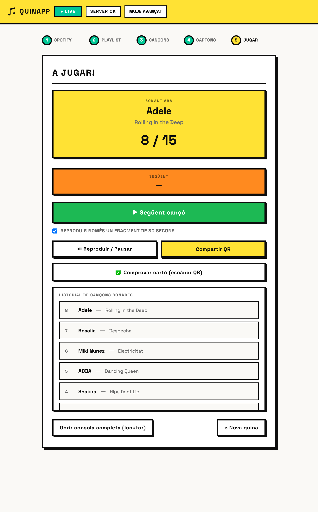
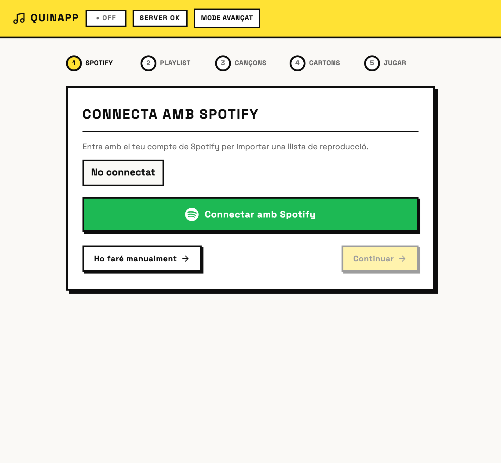
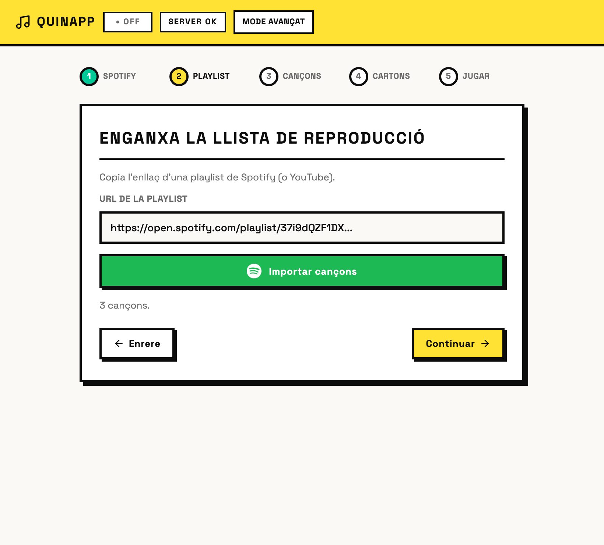
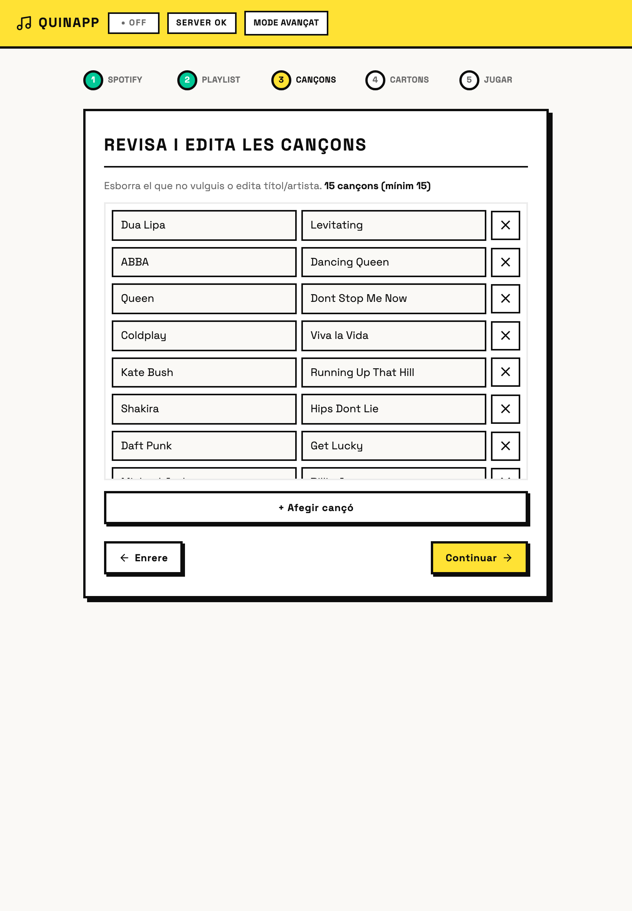
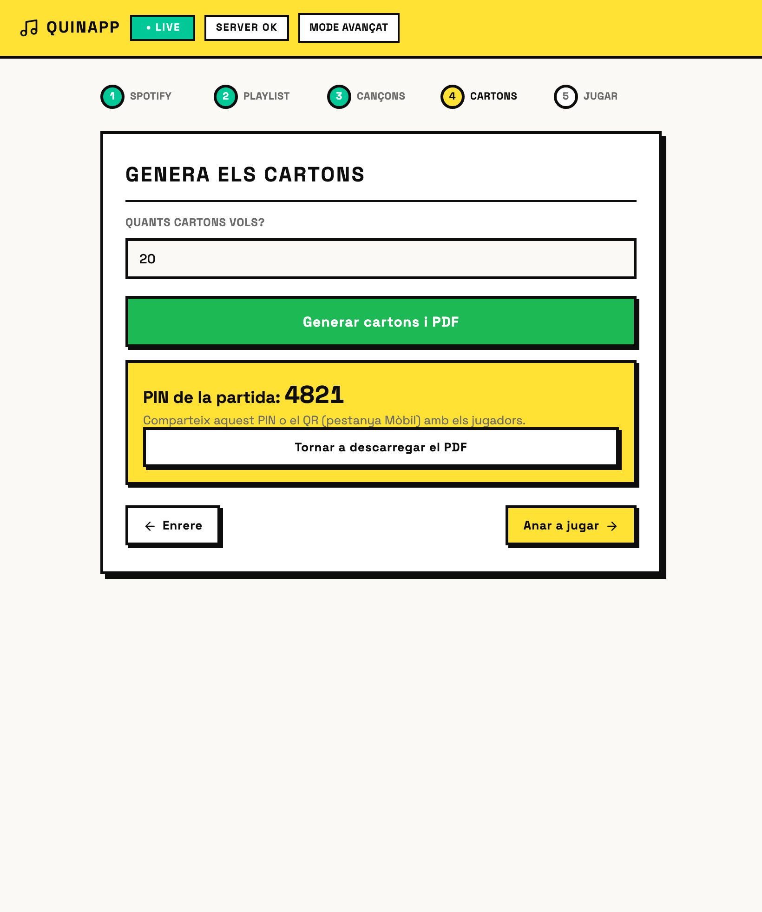
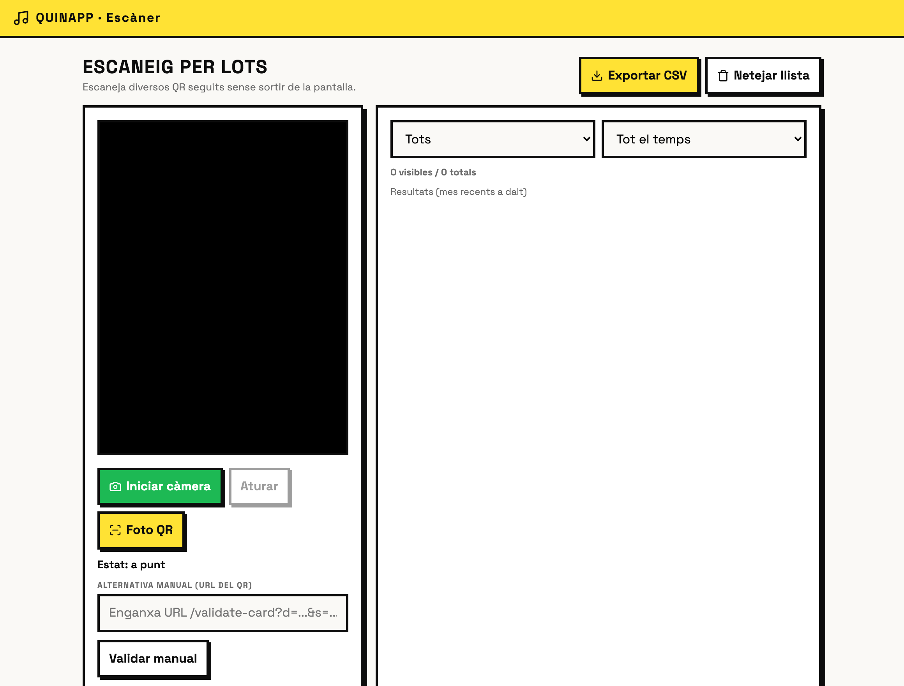
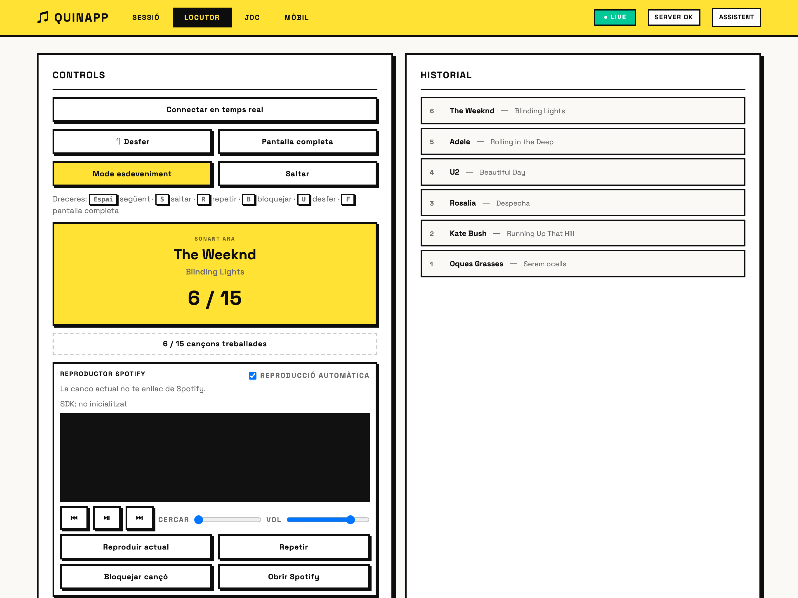
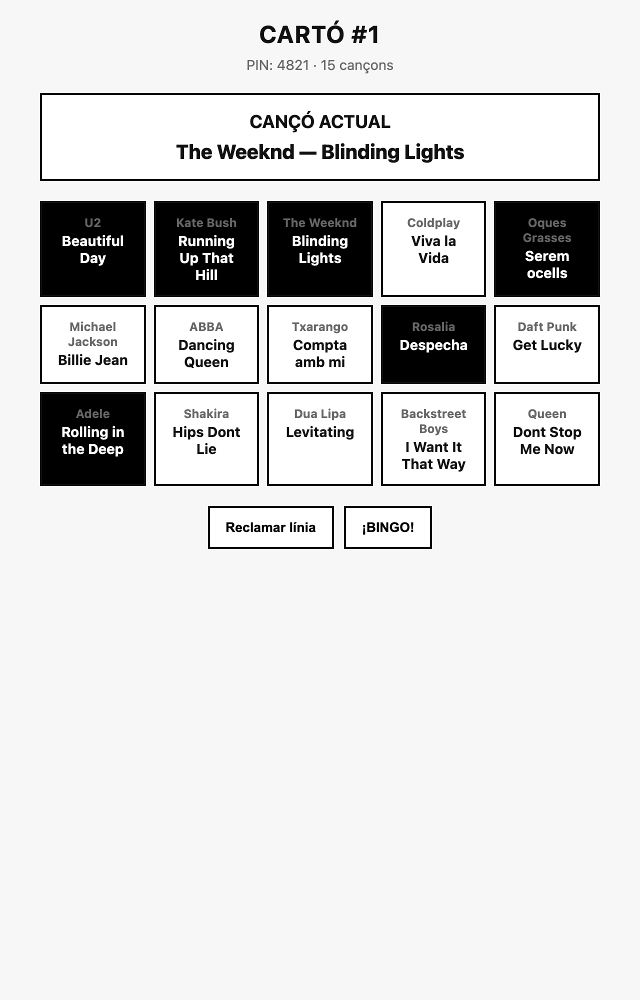

<div align="center">

#  QUINAPP

**Quina musical (bingo de cançons) per a esdeveniments — multiplataforma (navegador) i amb assistent guiat.**

Connecta amb Spotify, importa una playlist, genera cartons en PDF amb QR signats,
sorteja en directe amb reproducció automàtica (fragments de 30 s) i valida els cartons
guanyadors escanejant el QR des del mòbil.



</div>

---

## Què és

QUINAPP és una eina per organitzar **quines musicals** (bingo on cada casella és una
cançó). El locutor sorteja cançons una a una; els jugadors marquen el seu cartó i
canten *línia* o *bingo*. L'app gestiona tot el flux: muntar la llista, generar cartons,
imprimir-los en PDF amb un QR únic per cartó, sortejar en directe i validar els cartons
guanyadors escanejant el QR amb el mòbil.

Funciona de dues maneres sobre el **mateix servidor** (HTTP + SQLite):

-  **Mode navegador (multiplataforma)** — `npm start` arrenca el servidor i obre el
  navegador. Funciona a **macOS, Windows i Linux**. És el mode recomanat.
-  **App d'escriptori (opcional, macOS)** — embolcall Electron amb empaquetat `.dmg`.

En els dos casos el servidor també serveix la interfície per al mòbil dins la mateixa Wi-Fi.

>  **Accés directe (macOS):** hi ha un **`QUINAPP.app`** que ja funciona — **doble clic
> i s'obre l'app** al navegador, sense terminal ni comandes. Ideal per a usuaris no tècnics.
> Es genera amb `npm run app:macos` (vegeu més avall).

## Descàrregues

Instal·ladors a la **[darrera Release](https://github.com/ipaud/QUINAPP/releases/latest)**:

| Sistema | Descàrrega |
|---|---|
|  **macOS** (Apple Silicon) | [QUINAPP-0.1.0-arm64.dmg](https://github.com/ipaud/QUINAPP/releases/latest/download/QUINAPP-0.1.0-arm64.dmg) |
|  **Windows** (64-bit) | [QUINAPP-0.1.0-setup.exe](https://github.com/ipaud/QUINAPP/releases/latest/download/QUINAPP-0.1.0-setup.exe) |

> Builds **sense signar**: macOS → clic dret ▸ Obrir; Windows → «Més informació» ▸ «Executa igualment».
> Els enllaços funcionen quan el [workflow de release](.github/workflows/release.yml) acaba de compilar (uns minuts després de crear el tag).

## Característiques

-  **Assistent guiat de 5 passos** (vista per defecte): Spotify → Playlist → Cançons → Cartons → Jugar.
  Pensat per a usuaris sense coneixements tècnics. Botó **Mode avançat** per a la consola d'operador.
-  **Spotify integrat** — login amb **popup de consentiment** (PKCE, Client ID incrustat; l'usuari no
  escriu res), import de playlists i reproducció dins el navegador (Web Playback SDK, requereix Premium).
-  **Reproducció automàtica** en sortejar, amb mode **fragment de 30 s** opcional que comença per la
  part reconeixible (≈1/3 de la cançó, sol coincidir amb la tornada).
-  **Sorteig determinista i reproduïble** — basat en *seed*; mateixa seed → mateix ordre.
-  **Temps real (SSE)** — locutor, pantalla de joc i pàgines de jugador sincronitzats a l'instant.
-  **Generació de cartons** sense duplicats, mida configurable (files × columnes), PIN automàtic.
-  **PDF Pro** — A4 (2 per pàgina) o A5, predefinits (esdeveniment / impremta / estalvi tinta),
  cada cartó amb **QR signat (HMAC SHA-256)**.
-  **Validació des del mòbil** — escàner per lots (`/validate-batch`) amb so/vibració, fallback de
  **foto** i descodificació **jsQR servida local** (immune a adblockers).
-  **Importadors** — CSV, XLSX i llistes de YouTube/Spotify.
-  **Deep-links** — cada pestanya té `#hash`; `?load=PIN` carrega una sessió; `?mode=advanced` obre la consola.
-  **Accessibilitat** — focus visible, `aria-live`, navegació per teclat, `prefers-reduced-motion`.
-  **Seguretat** — CSP amb *nonce*, secret QR per instal·lació, rate-limit i validació estricta.
-  **Multiplataforma** — un sol servidor Node serveix tot; corre a macOS, Windows i Linux.

## Arquitectura

```
  Navegador (npm start)         o   Electron (npm run start:desktop, opcional)
        │                                     │
        └──────────────► http://127.0.0.1:3000 ◄───────────┘
                           │
        ┌──────────────────▼────────────────────┐
        │  apps/api  (Node http, sense framework) │
        │   ├─ REST + SSE realtime                │
        │   ├─ SQLite (better-sqlite3, WAL)       │
        │   ├─ PDF (pdf-lib) + QR (qrcode)        │
        │   └─ pàgines mòbil (validate / play)    │
        └──────────────────┬────────────────────┘
                           │  serveix
        ┌──────────────────▼────────────────────┐
        │  apps/web  (HTML/CSS/JS vanilla)        │
        │   Assistent (5 passos)  +  Mode avançat │
        │   (Sessió · Locutor · Joc · Mòbil)      │
        └─────────────────────────────────────────┘

 packages/core → lògica pura de bingo (determinista, testejable)
```

| Carpeta | Responsabilitat |
|---|---|
| [`packages/core`](packages/core) | Lògica pura: parseig de cançons, generació de cartons, RNG amb seed, comprovació de línies. |
| [`apps/api`](apps/api) | Servidor HTTP, SQLite, SSE, PDF, QR, importadors, pàgines servides al mòbil. |
| [`apps/web`](apps/web) | Client web: assistent de 5 passos + mode avançat (4 pestanyes); `vendor/jsQR.js`. |
| [`electron`](electron) | Embolcall d'escriptori **opcional**: arrenca el servidor, watchdog, finestra. |
| [`data`](data) | SQLite local + secret QR (ignorats per git). |

## Requisits

- **Node.js 18+** (recomanat 20 o 22) i `npm`. Cap altre requisit per al mode navegador.
- macOS, Windows o Linux.

>  `npm install` compila el mòdul natiu `better-sqlite3` per al teu Node (descarrega
> *prebuilds* per a les versions habituals). Si canvies de versió de Node i veus un error
> d'ABI (`NODE_MODULE_VERSION`), fes `npm rebuild better-sqlite3`.

## Instal·lació i execució

### Mode navegador (macOS · Windows · Linux) — recomanat

```bash
git clone https://github.com/ipaud/QUINAPP.git
cd QUINAPP
npm install
npm start              # arrenca el servidor i obre el navegador
```

- Servidor a `0.0.0.0:3000`; s'obre `http://127.0.0.1:3000` al navegador per defecte.
- Per a Spotify, passa el Client ID abans d'arrencar:
  - macOS/Linux: `SPOTIFY_CLIENT_ID=EL_TEU_ID npm start`
  - Windows (PowerShell): `$env:SPOTIFY_CLIENT_ID="EL_TEU_ID"; npm start`
- No vols que obri el navegador sol? `QUINAPP_NO_OPEN=1 npm start`.

#### Accés directe al Desktop (macOS)

Per a usuaris no tècnics, crea un **`QUINAPP.app`** que arrenca el servidor i obre el
navegador amb un doble clic (sense terminal):

```bash
SPOTIFY_CLIENT_ID=EL_TEU_ID npm run app:macos   # (el Client ID és opcional)
```

Apareix `QUINAPP.app` al Desktop amb la icona de l'app. Doble clic → llest.

### App d'escriptori (opcional, Electron)

```bash
npm run start:desktop          # finestra Electron
```

### Instal·ladors (.dmg macOS · .exe Windows)

```bash
npm run electron:pack:mac      # dist/QUINAPP-<versió>-arm64.dmg   (cal macOS)
npm run electron:pack:win      # dist/QUINAPP-<versió>-setup.exe   (cal Windows)
```

>  Cada instal·lador s'ha de compilar **al seu sistema** (el `.exe` no es pot generar
> de forma fiable des de Mac pel mòdul natiu i l'NSIS). Per generar-los tots dos
> automàticament hi ha un **GitHub Action** ([.github/workflows/release.yml](.github/workflows/release.yml)):
> crea un tag `v*` i compila el `.dmg` (runner macOS) i el `.exe` (runner Windows) i els
> adjunta a una **GitHub Release**:
>
> ```bash
> git tag v0.1.0 && git push origin v0.1.0
> ```
>
> Són builds **sense signar**: a macOS, clic dret → Obrir (Gatekeeper); a Windows,
> «Més informació» → «Executa igualment» (SmartScreen).

## Variables d'entorn

Copia [`.env.example`](.env.example) i ajusta el que calgui. Cap és obligatori per a ús
local; els més rellevants:

| Variable | Per a què | Per defecte |
|---|---|---|
| `PORT` / `HOST` | Port i host del servidor | `3000` / `127.0.0.1` (Electron força `0.0.0.0`) |
| `HTTPS_PORT` / `QUINAPP_HTTPS` | HTTPS (cert autosignat) per a la càmera mòbil | `3443` / actiu (`0` per desactivar) |
| `PUBLIC_BASE_URL` | URL pública als QR (ideal per LAN) | autodetecció IP local |
| `QR_HMAC_SECRET` | Secret per signar QR | aleatori persistit a `data/qr-secret.key` |
| `QR_TTL_DAYS` | Caducitat dels QR | `30` |
| `SPOTIFY_CLIENT_ID` | Login Spotify PKCE | — |
| `QUINAPP_DATA_DIR` | Directori de dades | `./data` (o `userData` a Electron) |
| `NODE_ENV` | `production` exigeix `QR_HMAC_SECRET` | — |

## Ús

### Assistent guiat (vista per defecte) — 5 passos

La primera pantalla és un **assistent** pensat per a qualsevol usuari:

**1. Spotify** — botó verd que obre el **popup de consentiment** (o «Ho faré manualment»).



**2. Playlist** — enganxa l'enllaç d'una llista (Spotify/YouTube) i importa les cançons.



**3. Cançons** — llista editable: afegeix, edita o esborra (mínim 15 per a cartons de 3×5).



**4. Cartons** — tria quants i prem **Generar cartons i PDF**; s'assigna un **PIN automàtic** de la partida.



**5. Jugar** — ** Següent cançó** (amb autoplay), **Sonant ara** + **Següent** + **historial**,
⏯ reproduir/pausar, toggle **fragment de 30 s**, **Compartir QR** (connexió mòbil) i
**✅ Comprovar cartó** (obre un QR cap a l'escàner de validació). Botó **Nova quina** per recomençar.


> L'estat de l'assistent es desa al navegador: si recarregues a mig flux, recupera el pas i les dades.

>  **Spotify (configuració única).** Com qualsevol app amb «Entra amb Spotify», QUINAPP
> necessita **una** app de Spotify registrada; el seu *Client ID* (que **no** és secret en
> PKCE) queda incrustat via `SPOTIFY_CLIENT_ID`. Llavors l'usuari final només veu el **popup
> de consentiment** de Spotify — no escriu cap ID.
>
> 1. Crea una app a <https://developer.spotify.com/dashboard> i copia el *Client ID*.
> 2. A *Redirect URIs* afegeix `http://127.0.0.1:3000/` (i la teva URL LAN si la fas servir).
> 3. Arrenca amb `SPOTIFY_CLIENT_ID=EL_TEU_ID npm start`.
>
> El botó verd obre una **finestra nova** de login/consentiment i torna sol a l'assistent.
> Sense configurar res, el primer clic mostra un camp per posar el Client ID un sol cop.
> Sense Spotify, fes servir «Ho faré manualment» i escriu/importa les cançons.

### Reproducció (Spotify Web Playback SDK)

- En sortejar, la cançó **sona sola** dins el navegador. Requereix **compte Premium**
  (limitació de Spotify per al SDK). Sense Premium, l'estat ho indica i pots reproduir
  des de l'app de Spotify manualment.
- El reproductor s'inicialitza en entrar al pas «Jugar» i la reproducció espera que el
  dispositiu SDK estigui registrat (evita l'error «Device not found»).
- **Fragment de 30 s** (per defecte actiu): comença a ≈1/3 de la cançó i pausa als 30 s,
  com una preview. Es pot desactivar per sentir la cançó sencera.

### Validació de cartons (mòbil)

- Des del pas «Jugar», **✅ Comprovar cartó** mostra un QR cap a `/validate-batch`, l'escàner
  continu. Obre'l al mòbil (mateixa Wi-Fi) per validar els cartons dels jugadors.
- L'escàner descodifica amb **jsQR servit local** (`/vendor/jsQR.js`) → funciona encara que
  un adblocker bloquegi CDNs.
- La **càmera en directe** requereix context segur. Per això s'arrenca també un servidor
  **HTTPS** (port `3443`) amb cert autosignat; el QR de «Comprovar» hi apunta. Al mòbil,
  accepta l'avís de certificat un cop i ja pots usar la càmera. (Alternativa sempre vàlida:
  el botó **«Foto QR»**, que fa una foto del QR.)

<p align="center"></p>

### Mode avançat

El botó **Mode avançat** (capçalera) mostra la consola completa per a operadors, amb
4 pestanyes: **Sessió · Locutor · Joc · Mòbil** (seed, PIN admin, importadors CSV/XLSX,
PDF Pro detallat, dreceres de teclat al locutor: `Espai` següent · `S` saltar · `R`
repetir · `B` bloquejar · `U` desfer · `F` pantalla completa).

<p align="center"></p>

## API

Endpoints principals (servits a `:3000`):

```
POST   /api/sessions                      crear sessió
GET    /api/sessions/:pin                 estat de la sessió
GET    /api/sessions/:pin/events          SSE (snapshot + draw.next + ping)
POST   /api/sessions/:pin/cards           generar cartons
GET    /api/sessions/:pin/cards[/:id]     llistar / obtenir cartó
GET    /api/sessions/:pin/cards/:id/pdf   PDF d'un cartó
POST   /api/sessions/:pin/pdf-pro         PDF per lot (a4-2up | a5)
POST   /api/sessions/:pin/draw/next       sortejar següent cançó
GET    /api/sessions/:pin/draw/peek       espiar següent
POST   /api/sessions/:pin/draw/undo       desfer (admin si n'hi ha)
POST   /api/sessions/:pin/claims          validar línia / bingo
POST   /api/sessions/:pin/import-songs    substituir cançons
POST   /api/sessions/:pin/reset-round     nova tanda (admin)
DELETE /api/sessions/:pin                 esborrar sessió (admin)
GET    /api/validate-card?d=..&s=..       validar QR signat
POST   /api/tools/parse-csv | parse-xlsx | import-playlist | analyze-songs
GET    /api/tools/spotify-config          Client ID de Spotify (si està configurat)
GET    /api/system/network | health       xarxa / health
GET    /api/system/qr?path=/validate-batch QR (server-side) d'un path, sense CDN
POST   /api/system/probe                  prova de connexió (només LAN)
```

Pàgines HTML per al mòbil: `/play-card`, `/validate-card`, `/validate-batch`.

## Validació QR (mòbil)

- Cada cartó del PDF porta un **QR individual signat amb HMAC SHA-256**.
- El QR apunta a `/validate-card?d=<payload>&s=<firma>`; la validació és **dinàmica**
  contra les cançons ja sonades de la sessió.
- `/validate-batch` permet escanejar molts QR seguits: càmera en directe (detector natiu o
  **jsQR servit local**) o **foto del QR**, amb so/vibració i exportació CSV.
- `/play-card` és la pantalla del jugador al mòbil: marca les caselles i reclama línia/bingo.

<p align="center"></p>

## Seguretat

- **CSP amb nonce** a totes les pàgines HTML — els scripts injectats no s'executen.
- **Escapat estricte** de dades d'usuari a les pàgines renderitzades (sense XSS via títols).
- **Secret QR per instal·lació** generat i persistit; cap secret a dins el codi.
- **Rate-limit** per IP a creació de sessió, sorteig, *claims* i intents de PIN admin.
- **Validació de mida** de cos, *path* estàtic confinat i *probe* de xarxa limitat a LAN.

## Empaquetar (macOS)

```bash
npm run electron:pack:mac      # genera dist/QUINAPP-<versió>-arm64.dmg
```

## Tests

```bash
npm run test:unit         # lògica pura (core, QR, normalització, PDF)
npm test                  # unit + integració (requereix better-sqlite3 per al Node actiu)
```

## Estructura del projecte

```
QUINAPP/
├─ apps/
│  ├─ api/   servidor (server.mjs, data/, lib/, assets/fonts)
│  └─ web/   client (index.html, main.js, styles.css, vendor/jsQR.js)
├─ packages/core/   lògica de bingo (pura)
├─ electron/        embolcall d'escriptori (opcional)
├─ scripts/         start.mjs (llançador multiplataforma) + utilitats
├─ tests/           unit + integració
├─ data/            SQLite + secret QR (git-ignored)
└─ docs/screenshots/
```

## Llicència

[MIT](LICENSE) © 2026 ipaud
